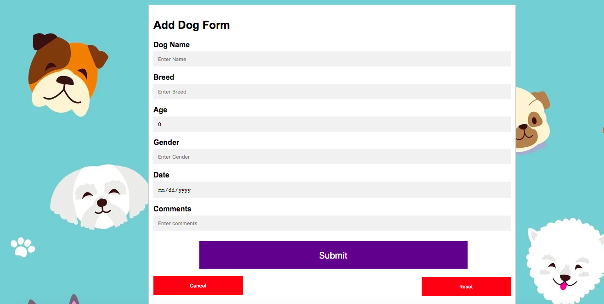
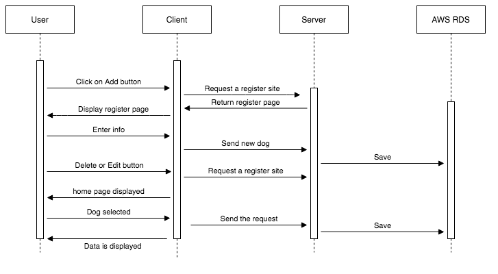

# San Jose State University
## Enterprise Software - CMPE 172 / Spring 2020
## Team 11 Members : Uyen Nguyen, Dung Pham, Sara Aktar
### Project Introduction
Almost 3.3 million dogs enter dog shelters every year. Because of this, some dog shelters struggle with housing dogs and getting them adopted quickly to do so. These shelters cannot make this process faster and easier if there are not enough resources. Sometimes, they lack the proper organization and structure to determine which dogs need to be adopted or which factors contribute to this process. Our project is to create a database and use its analytics to help these shelters. We will create a mock database that will analyze which dog breeds get entered into the system the most and which get adopted the most. Some dog shelters house more dogs of certain breeds, age, or gender than others; the same applies to adoption. Dog shelters will use the analytics of the database as a way to improve their adoption rates. Our project will incorporate concepts in Enterprise Software to create this solution. In specific, we will focus on which breed comes in the most as our analytics. 
### Demo Screenshots

### Set-Up
### How To Run The Project
# Clone this repository
- cd Desktop
- git clone https://github.com/uyen-carolyn/CMPE-172-Proj.git
- Open your Spring Tool Editor(you can install any supported Spring editor )
- File--> Open file from..(Desktop/CMPE-172-Proj)
- You show have your database schema and Dog table created.
- Click Run As É Spring Boot App
- Go to localhost:8080/dog/
### Diagrams
* UML Diagram

* Class Diagram
* Sequence Diagram

### Database Queries
(username: root, pass:key91191)
use testdb;

CREATE TABLE IF NOT EXISTS `Dog`(
	`id` int(11) AUTO_INCREMENT PRIMARY KEY NOT NULL,
	`name` varchar(50),
      `breed` varchar(50),
      `age` int,
      `gender` varchar(10),
      `date` varchar(50),
      `comments` varchar(50)
    );
    select*from `Dog`;
    INSERT INTO `Dog` (name, breed, age, gender, date, comments) values ("sy", "chi",1,"male","2-11-2019","N/A");
### Midtier APIs
       CRUD
### UI Data Transport
* .xml
* .json
* etc. 
